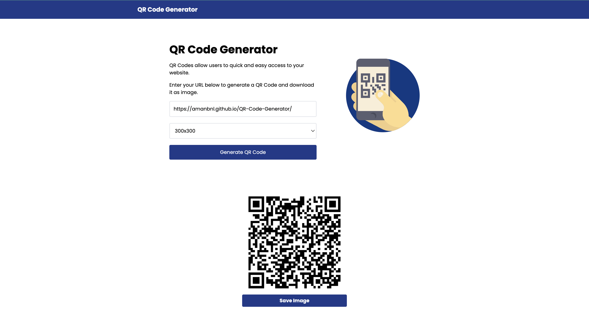

# QR Code Generator

Simple app to generate and download a QR code that can be used to share a link. To get Start follow these steps -
1. Enter the url for which you want to generate QR Code.
2. select the size from available size options.
3. Hit the Generate Qr Code button.
4. download the QR Code and use it in the way you want.

Clikc here[Live Demo](https://amanbnl.github.io/QR-Code-Generator/) for the live demo.

## Contributing 👏
- :octocat: [Pull requests](https://github.com/amanbnl/QR-Code-Generator/pulls) and 🌟 stars are always welcome.
- For changes, please open an [issue](https://github.com/amanbnl/QR-Code-Generator/issues) first to discuss what you would like to change.
## Contact 📩
📧 amanbnl6501@gmail.com

💼 Linkedin [@AmandeepSingh](https://www.linkedin.com/in/amandeep-singh-24a82b247/)

## License
MIT &copy; [Amandeep Singh](https://github.com/amanbnl)
